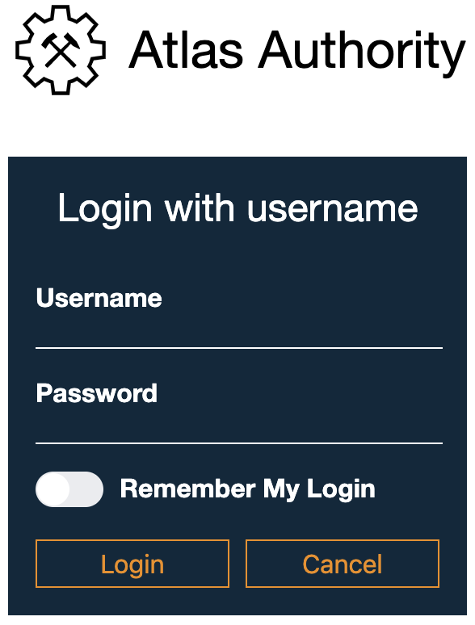

# Atlas CLI: Verbindung zu einer Atlas Engine aufbauen

## Voraussetzungen

* Die Atlas Engine muss auf dem lokalen oder auf einem entfernten System installiert sein, siehe [Installationsanleitung Atlas Engine](./install.md) //ToDo: Link anpassen. Alternativ können Sie sich auch das BPMN Studio / Atlas Studio mit einer integrierten Atlas Engine installieren, siehe [Installationsanleitung BPMN Studio / Atlas Studio](./install.md).
* Die Atlas CLI muss auf dem lokalen System installiert sein, siehe [Installationsanleitung Atlas CLI](./install.md).

## Einloggen in die Atlas CLI

Damit Sie mit der Atlas Engine über die Atlas CLI interagieren können, müssen Sie sich zunächst einloggen. Dies können Sie durch den folgenden Befehl realisieren:

```shell
atlas login <ENGINE_URI>
```

---
**Info:**
Die `ENGINE_URI` variiert je nach Installation und Einrichtung ihrer Atlas Engine. Auf einem Entwicklungssystem wird vorwiegend die Atlas Engine lokal auf dem selben System betrieben. Dazu verwenden Sie einfach `localhost` und den entsprechend konfigurierten Port.
Die Ports haben bei der Einrichtung Standardwerte für die verschiedenen Freigabekanäle. Es folgt eine Auflistung der Standardwerte für jede Installationsart und jeden Freigabekanal:

| Installationsart                          | Freigabekanal | Standardport |
|-------------------------------------------|------------------------------|:------------:|
| Atlas Engine                    | alpha                        |     10580     |
| Atlas Engine                    | beta                         |     10570     |
| Atlas Engine                    | stable                       |     10560     |
| Atlas Engine via BPMN Studio / Atlas Studio | alpha                        |     56200    |
| Atlas Engine via BPMN Studio / Atlas Studio | beta                         |     56100    |
| Atlas Engine via BPMN Studio / Atlas Studio | stable                       |     56000    |

Die Ports der Atlas Engine können im Rahmen der [Konfiguration](https://github.com/atlas-engine/AtlasEngine/master/docs/install.md) individuell angepasst werden. Sofern die Einstellung nicht den Standardwerten entsprechen, müssen Sie die Verbindungsparameter entsprechend anpassen.

---

### Produktions- oder Testsystem

Auf Produktions- oder Testsystemen empfiehlt sich die Atlas Engine nicht innerhalb eines BPMN Studios / Atlas Studios zu betreiben. Mit einer Atlas Engine aus dem 'stable' Freigabekanal, die auf einem Server (mit der IP-Adresse 10.10.32.7) installiert wurde, können Sie sich wie folgt einloggen:

```shell
atlas login http://10.10.32.7:10560
```

Es öffnet sich nun ein Webbrowser mit der von Ihnen konfigurierten Atlas Authority.



Geben Sie Ihre Anmeldeinformationen ein und bestätigen Sie mit "Login". Abhängig von Ihrer Konfiguration der Atlas Authority ist es auch möglich, dass sie sich mit einem Provider wie Microsoft oder Google einloggen können.

---
**Info:**
Die Atlas Authority ist für die Authentifizierung und Autorisierung in der Atlas Platform zuständig. Wenn Sie mehr dazu erfahren möchten, können Sie sich im Abschnitt [Atlas Authority](ToDo) detaillierter informieren.

---

### Entwicklungssystem

Wenn Sie sich auf einem Entwicklungssystem befinden empfiehlt sich die Option für anonymen "Root-Zugriff" in der Atlas Engine freizuschalten. Bei einer Atlas Engine können Sie diese Einstellung [konfigurieren](.install.md). Bei der im BPMN Studio / Atlas Studio integrierten Atlas Engine ist diese Option standardmäßig eingeschaltet.

Mit einer im BPMN Studio / Atlas Studio integrierten Atlas Engine aus dem 'stable' Freigabekanal, die lokal installiert wurde und dessen anonymen "Root-Zugriff" erlaubt ist, können Sie sich wie folgt einloggen:

```shell
atlas login http://localhost:56000 --root
```

---
**Info:**
Die Atlas CLI nimmt als Standardprotokoll `http` und als Standardhost `localhost`. Dadurch ist auf Entwicklungssystemen die verkürzte Schreibweise für das Anmelden möglich:

```shell
atlas login :56000 --root
```

---
