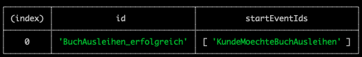
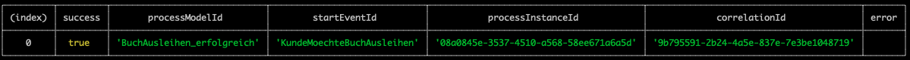
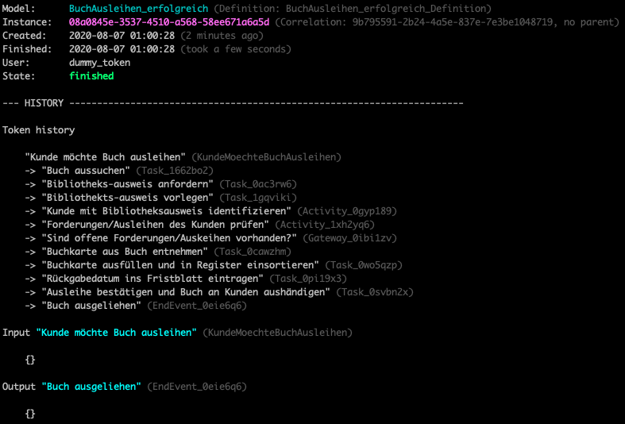
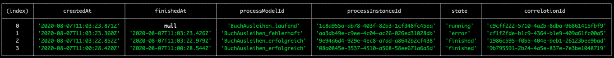
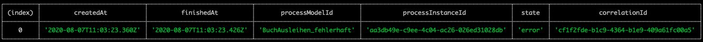
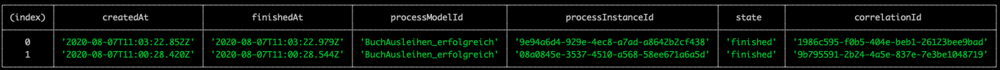
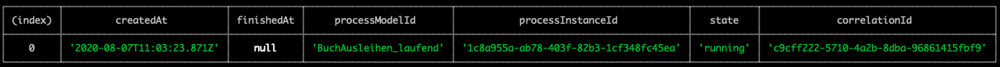
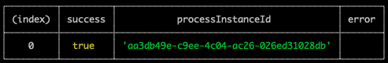

# Guideline für den Betrieb

## Vorraussetzungen

* Sie müssen die Atlas.CLI installiert haben. Siehe [Installationsanleitung Atlas.CLI](./install.md)
* Sie müssen sich zuvor mithilfe der Atlas.CLI mit einer AtlasEngine verbunden haben. Siehe [Guideline CLI: Verbindung aufbauen](./guideline-CLI-connect.md)
* Laden Sie sich das [Beispiel](./example) herunter. Darin sind mehrere Prozesse und Shell-Scripte enthalten. Sie können jederzeit das Script `cleanup-state-for-show-process-instance.sh` um ihre Umgebung in den Anfangszustand zurück zuversetzen.
  
## Deployment von Prozessmodellen
Um BPMN-Prozesse mit der AtlasEngine ausführen zu können müssen diese zunächst an die AtlasEngine übertragen werden. Diese Schritt bezeichnet man als Deployment und kann mit dem folgenden Befehl ausgeführt werden: 
```shell
atlas deploy-files ./example/Processes/BuchAusleihen_erfolgreich.bpmn
```
Als Ergebis des Befehls wird zu dem deployten BPMN die "process_model_id" angezeigt:


Die "process_model_id" ist fest im BPMN hinterlegt und gleicht häufig dem Namen der *.bpmn Datei. Jedoch kann die "process_model_id" auch von Dateinamen des BPMNs abweichen. Sie können die "process_model_id" zusätzlich mithilfe des Ergebnisses des Befehls `list-process-models` aus dem Abschnitt [Anzeigen von Prozessmodellen](#Anzeigen-von-Prozessmodellen) in der Spalte "id" identifizieren.

## Anzeigen von Prozessmodellen
Sie können sich vergewissern, welche Prozessmodelle deployed wurden, indem Sie sich alle deployten Prozessmodelle auflisten lassen. Dies können Sie mit dem folgenden Befehl realiseren:
```shell
atlas list-process-models
```
Als Ergebnis werden alle deployten Prozessmodelle angezeigt: 



## Starten von Prozess-Instanzen
Nachdem das Prozessmodel deployed ist können Sie eine Prozess-Instanz starten. Dies können Sie mit dem Befehl `start-process-model` realisieren, indem Sie die "process_model_id" als Parameter übergeben:
```shell
atlas start-process-model BuchAusleihen_erfolgreich
```

Es folgt eine tabellarische Ausgabe der Eigenschaften der gestarteten ProzessInstanz innerhalb der Konsole:


**Info**

Die angezeigte `processInstanceId` ist das Eindeutigkeitskriterium einer jeden Prozess-Instanz.

## Anzeigen von Prozess-Instanzen

Im Abschnitt [Starten von Prozess-Instanzen](#Starten-von-Prozess-Instanzen) haben Sie eine Prozess-Instanz gestartet. In diesem Abschnitt soll die gestarte Prozess-Instanz angezeigt werden. Dies können Sie mit folgendem Kommando ausführen:
```shell
atlas show-process-instance '08a0845e-3537-4510-a568-58ee671a6a5d'
```
**Info**

Als Parameter wird die `processInstanceId` von der gestarteten Prozess-Instanz übergeben. Wenn Sie den Befehl auf Ihrer Umgebung ausführen, müssen Sie die `processInstanceId` von Ihrer gestarteten Prozess-Instanz angeben. Dazu müssen Sie die `processInstanceId` aus der Ausgabe von [Starten von Prozess-Instanzen](#Starten-von-Prozess-Instanzen) nutzen.

Es folgt die Ausgabe der Eigenschaften der Prozess-Instanz innerhalb der Konsole:


Für die folgenden Abschnitte benötigen Sie einen definierten Status um bei jedem Abschnitt das beschriebene Ergebnis zu erhalten. Um den definierten Status zu erreichen führen Sie einfach folgenden Befehl aus:
```shell
sh ./example/setup-state-for-show-process-instance.sh
```
Mit diesem Befehl werden die Prozessmodelle "BuchAusleihen_erfolgreich", "BuchAusleihen_fehlerhaft" und "BuchAusleihen_laufend" die sich in dem "Processes"-Ordner befinden deployed und gestartet.

Um sich die gestarten Prozess-Instanzen anzeigen zu lassen können Sie folgenden Befehl ausführen:
```shell
atlas list-process-instances
```
Als Ergebnis erhalten Sie eine tabellarische Auflistung aller Prozess-Instanzen:

Jede der aufgelisten Prozess-Instanz befindet sich in einem anderen Status:
* BuchAusleihen_laufend --> running
* BuchAusleihen_fehlerhaft --> error
* BuchAusleihen_erfolgreich --> finished

Die AtlasCLI bietet die Möglichkeit nach spezifischen Merkmalen von Prozess-Instanzen zu filtern, die auch in der integrierten Hilfe `atlas list-process-instances --help` detailiert beschrieben werden. In den folgenden Abschnitten lernen Sie einige dieser Filtermöglichkeiten kennen.
### Filtern nach fehlgeschlagener Prozess-Instanzen
```shell
atlas list-process-instances --filter-by-state error
```
Als Ergebnis erhalten Sie eine tabellarische Auflistung aller Prozess-Instanzen im Status 'error':


### Filtern nach erfolgreicher Prozess-Instanzen
```shell
atlas list-process-instances --filter-by-state finished
```
Als Ergebnis erhalten Sie eine tabellarische Auflistung aller Prozess-Instanzen im Status 'finished':

### Filtern nach laufenden Prozess-Instanzen
```shell
atlas list-process-instances --filter-by-state running
```
Als Ergebnis erhalten Sie eine tabellarische Auflistung aller Prozess-Instanzen im Status 'running':


## Fortsetzen fehlgeschlagener Prozess-Instanzen
Wenn zum Beispiel ein Service der aus dem Prozess aufgerufen wird kurzzeitig nicht zur Verfügung steht, kann es vorkommen, dass Aktivitäten innerhalb des Prozesses fehlschlagen. Prozess-Instanzen werden dann in den Zustand "error" versetzt. Prozess-Instanzen in diesem Zustand können forgesetzt werden. Dabei wird die zufor fehlgeschlagene Operation erneut ausgeführt. In den folgenden Abschnitten wird beschrieben wie sie einzelne oder alle fehlgeschlagene Prozess-Instanzen fortsetzen können.

### Fortsetzen einzelner Prozess-Instanzen
Um einzelne Prozess-Instanzen fortzusetzen müssen Sie zunächst die `processInstanceId` identifizieren, die sie fortsetzen möchten. Dazu können Sie wie im Abschnitt [Filtern nach fehlgeschlagener Prozess-Instanzen](#Filtern-nach-fehlgeschlagener-Prozess-Instanzen) beschrieben vorgehen. Die `processInstanceId` wird als Paramter für den Befehl `atlas retry-process-instance` benötigt. 
```shell
atlas retry-process-instance aa3db49e-c9ee-4c04-ac26-026ed31028db
```
### Fortsetzen aller Prozess-Instanzen
Ergebisse von Befehlen können mithilfe der Atlas.CLI auch als Eingangsparameter in andere Befehle mithilfe der Pipe-Operators (`|`) umgeleitet werden. Erforderlich hierfür ist, dass die Eingabe an den Folgebefehl im JSON-Format übergeben wird. Dies können Sie realisieren, indem Sie am vorangegangen Befehl das Ausgabeformat mithilfe der `--output` Option festlegen.
So ist es möglich zunächst alle fehlgeschlagenen Prozess-Instanzen zu ermitteln und diese im Anschluss fortzusetzen: 
```shell
atlas list-process-instances --filter-by-state error --output json | atlas retry-process-instance
```
Unanhängig, ob Sie eine einzelne oder alle fehlgeschlagenen Prozess-Instanzen fortgesetzt haben wird folgende Ausgabe angezeigt:



