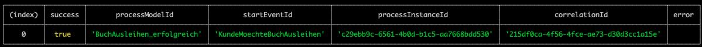
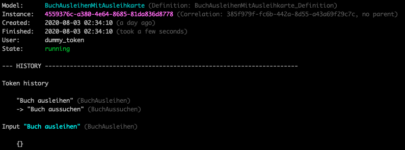

# Guideline für den Betrieb

## Vorraussetzungen

* Sie müssen die Atlas.CLI installiert haben. Siehe [Installationsanleitung Atlas.CLI](./install.md)
* Sie müssen sich zuvor mithilfe der Atlas.CLI mit einer AtlasEngine verbunden haben. Siehe [Guideline CLI: Verbindung aufbauen](./guideline-CLI-connect.md)
* Laden Sie sich das [Beispiel](./example) herunter. Darin ist ein Prozess und mehrere Shell-Scripte enthalten.
  
## Deployment von Prozessen

```shell
atlas deploy-files ./example/Process/BuchAusleiheMitAusleihkarteDigital.bpmn
```

## Starten von Prozess-Instanzen

```shell
atlas start-process-model BuchAusleihenMitAusleihkarte
```
* Woher bekomme ich die "process_model_id" ?

Es folgt eine tabellarische Ausgabe der Eigenschaften der gestarteten ProzessInstanz innerhalb der Konsole:

Die angezeigte `processInstanceId` ist das Eindeutigkeitskriterium einer jeden Prozess-Instanz.

## Anzeigen von ProzessInstanzen

Im Abschnitt [Starten von ProzessInstanzen](#Starten-von-Prozess-Instanzen) haben Sie eine Prozess-Instanz gestartet. In diesem Abschnitt soll die gestarte Prozess-Instanz angezeigt werden. Dies können Sie mit folgendem Kommando ausführen:
```shell
atlas show-process-instance '4559376c-a380-4e64-8685-81da836d8778'
```
**Info**

Als Parameter wird die `processInstanceId` von der gestarteten Prozess-Instanz übergeben. Ihre `processInstanceId` wird einen anderen Wert haben. Sie müssen die `processInstanceId` aus der Ausgabe von [Starten von ProzessInstanzen](#Starten-von-Prozess-Instanzen) nutzen.

Es folgt die Ausgabe der Eigenschaften der Prozess-Instanz innerhalb der Konsole:


### Anzeigen fehlgeschlagener ProzessInstanzen
### Anzeigen erfolgreicher ProzessInstanzen
### Anzeigen laufender ProzessInstanzen

## Fortsetzen fehlgeschlagener ProzessInstanzen
### Fortsetzen einzelner ProzessInstanzen
### Fortsetzen aller ProzessInstanzen

